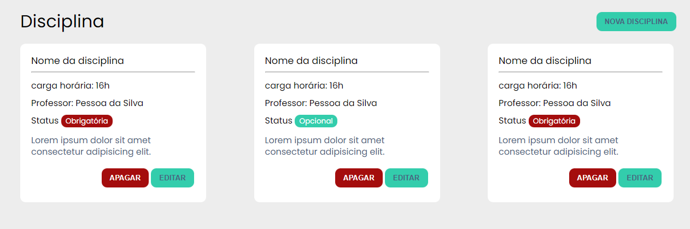
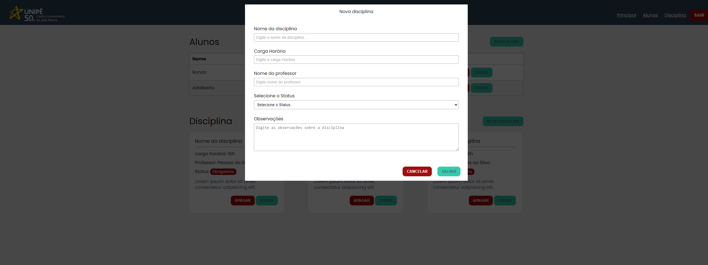
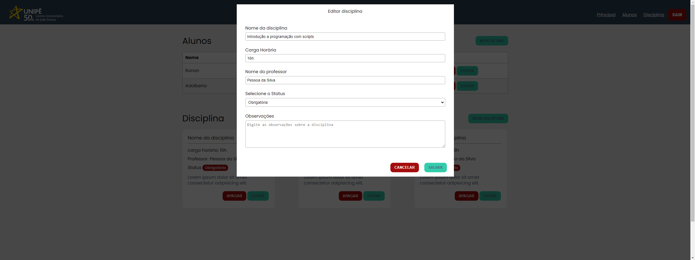

## Descrição

Projeto desenvolvido para servir de apoio e referência para os alunos de pós graduação em Desenvolvimento de Aplicações Web na disciplina de Introdução a programação com scripts

### JSON Server
#### Instalação

```
npm install -g json-server
```

#### Criando a base de dados

Crie um arquivo de nome *db.json* na raiz do projeto.
```json
{
  "alunos": [
    {
      "nome": "Kleber",
      "matricula": "001",
      "curso": "Sistemas para internet",
      "id": 1
    },
    {
      "nome": "Khalel",
      "matricula": "dsdfddsd23323",
      "curso": "Redes",
      "id": 3
    }
  ],
  "disciplinas": [
    {
      "id": 1,
      "nome": "Introdução a progração com scripts",
      "cargaHoraria": "60h",
      "professor": "Nélio Frazão",
      "status": "Obrigatória",
      "observacoes": ""
    },
    {
      "nome": "Fundamentos da Computação",
      "cargaHoraria": "60h",
      "professor": "Khalel",
      "status": "Obrigatória",
      "observacoes": "Praesent sollicitudin purus nec dui tincidunt blandit. Etiam vehicula ut urna in placerat. ",
      "id": 2
    },
    {
      "id": 3,
      "nome": "Sistemas para internet",
      "cargaHoraria": "60h",
      "professor": "Kelvin",
      "status": "Obrigatória",
      "observacoes": ""
    },
    {
      "nome": "Inglês",
      "cargaHoraria": "30h",
      "professor": "Kate",
      "status": "Opcional",
      "observacoes": "Donec at efficitur magna. Integer posuere neque ut metus dapibus, in mollis nulla viverra.",
      "id": 4
    },
    {
      "nome": "Português",
      "cargaHoraria": "30h",
      "professor": "Kelvin",
      "status": "Opcional",
      "observacoes": "sdjdsjdsj lkfdklfkldf",
      "id": 5
    },
    {
      "nome": "Matemática",
      "cargaHoraria": "60h",
      "professor": "Khalel",
      "status": "Obrigatória",
      "observacoes": "1 + 1 = 2",
      "id": 6
    }
  ]
}
```

#### Iniciando o servidor
Execute o comando para inicar o servidor. Por padrão a API vai funcionar no enderço: http://localhost:3000

```
json-server --watch db.json
```

**Rotas** Aluno:

| Request | URL |  Observações |
|-|-|-|
| **GET** | /alunos | Busca todos os alunos
| **GET** | /alunos/1 | Busca por um aluno
| **POST** | /alunos | Salva um aluno na base de dados
| **PUT** | /alunos/1 | Atualiza os dados do aluno
| **DELETE** | /alunos/1 | Remove um aluno

**Rotas** Disciplina:

| Request | URL |  Observações |
|-|-|-|
| **GET** | /disciplinas | Busca todos as disciplinas
| **GET** | /disciplinas/1 | Busca por uma disciplinas
| **POST** | /disciplinas | Salva uma disciplinas na base de dados
| **PUT** | /disciplinas/1 | Atualiza os dados de uma disciplinas
| **DELETE** | /disciplinas/1 | Remove uma disciplinas

## Desafio
### Parte 1posto;
* Adicionar botão **Nova disciplina** de acordo com o layout proposto;
* Adicionar botões **APAGAR** e **EDITAR** nos cards de disciplina de acordo com o layout;
* Caso o campo status receba o valor **Obrigatório** deve exibir o código
```html
<span class="tag tag--danger">Obrigatória</span>;
```
* Caso o campo status receba o valor **Opcional** deve exibir o código 
```html
<span class="tag tag--success">Opcional</span>;
```
* Criar uma função para exibir os cards de forma dinâmica consumindo os dados da api ``GET: /disciplinas``


### Parte 2
* Ao clicar no botão **Nova disciplina** deverá abrir o formulário de cadastro da disciplina;
* As opções do campo **Selecione o Status** deverão ser: **Obrigatória** e **Opcional**;
* Salvar os dados do formulário na API api ``POST: /disciplinas``


### Parte 3
* Quando clicar no botão **editar** no card de disciplina deve abrir o modal de edição carregando todas as informações da disciplina;
* O título do modal será Editar Disciplina;
* Salvar os dados do formulário na API api  ``PUT: /disciplinas/:id``


### Parte 3
* Quando clicar no botão **apagar** no card de disciplina deve excluir a disciplina;a;
* apagar os dados da Disciplina na API api  ``DELETE: /disciplinas/:id``

### IMPORTANTE
Todos os layouts se encontram na pasta ``layout/desafio/``

Se você está contribuindo com este projeto, é recomendável que você saiba:
* [HTML5](https://www.w3c.br/pub/Cursos/CursoHTML5/html5-web.pdf)
* [CSS](https://www.w3c.br/Cursos/CursoCSS3/)
* [JAVASCRIPT](https://developer.mozilla.org/en-US/docs/Web/JavaScript)